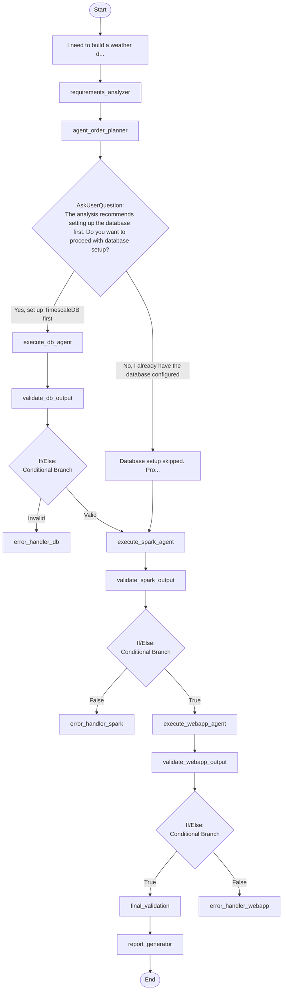

## Workflow Execution Guide

Follow the Mermaid flowchart above to execute the workflow. Each node type has specific execution methods as described below.

### Execution Methods by Node Type

- **Rectangle nodes**: Execute Sub-Agents using the Task tool
- **Diamond nodes (AskUserQuestion:...)**: Use the AskUserQuestion tool to prompt the user and branch based on their response
- **Diamond nodes (Branch/Switch:...)**: Automatically branch based on the results of previous processing (see details section)
- **Rectangle nodes (Prompt nodes)**: Execute the prompts described in the details section below

### Prompt Node Details

#### prompt_1770201456002(I need to build a weather d...)

```
I need to build a weather data system with the following requirements:

{{user_requirements}}

Please analyze what components are needed and create:
- Database schema (if needed)
- Data processing pipeline (if needed)
- Web dashboard (if needed)

Context:
- Technology Stack: {{tech_stack}}
- Timeline: {{timeline}}
- Team Size: {{team_size}}
```

#### prompt_1770203500570(Database setup skipped. Pro...)

```
Database setup skipped. Proceeding with Spark and WebApp agents only.

Note: Ensure your database is already configured at:
- Host: {{db_host}}
- Database: {{db_name}}
- Schema: {{db_schema}}"

Variables: db_host, db_name, db_schema
```

### AskUserQuestion Node Details

Ask the user and proceed based on their choice.

#### question_1770200452878(The analysis recommends setting up the database first. Do you want to proceed with database setup?)

**Selection mode:** Single Select (branches based on the selected option)

**Options:**
- **Yes, set up TimescaleDB first**: yes_db_setup
- **No, I already have the database configured**: no_db_skip

### If/Else Node Details

#### ifelse_1770202089040(Binary Branch (True/False))

**Evaluation Target**: proceed_to_next_agent == true

**Branch conditions:**
- **Valid**: When condition is true
- **Invalid**: When condition is false

**Execution method**: Evaluate the results of the previous processing and automatically select the appropriate branch based on the conditions above.

#### ifelse_1770202793865(Binary Branch (True/False))

**Evaluation Target**: proceed_to_next_agent == true

**Branch conditions:**
- **True**: When condition is true
- **False**: When condition is false

**Execution method**: Evaluate the results of the previous processing and automatically select the appropriate branch based on the conditions above.

#### ifelse_1770203224918(Binary Branch (True/False))

**Evaluation Target**: proceed_to_next_agent == true

**Branch conditions:**
- **True**: When condition is true
- **False**: When condition is false

**Execution method**: Evaluate the results of the previous processing and automatically select the appropriate branch based on the conditions above.
